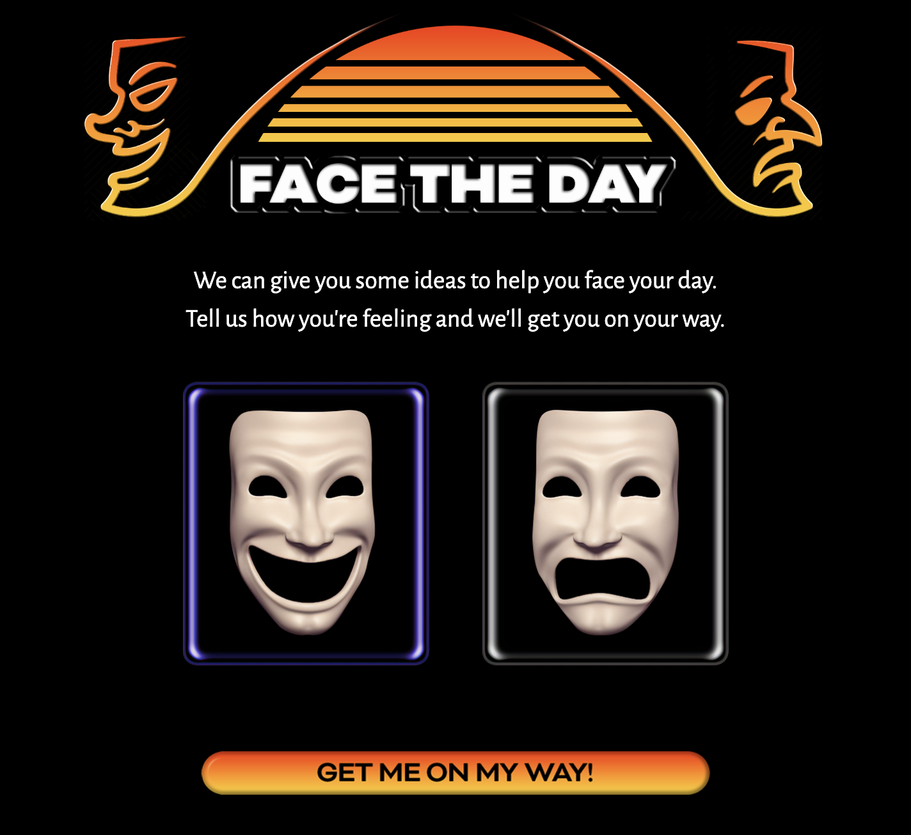
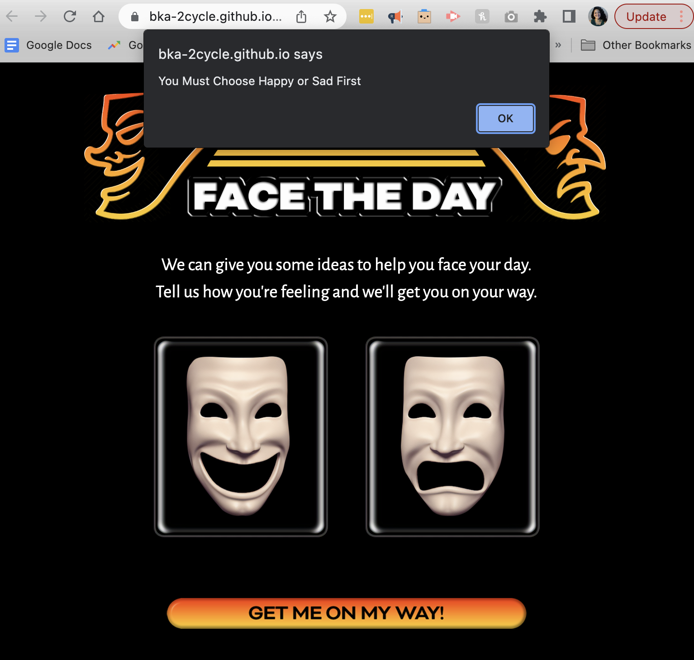
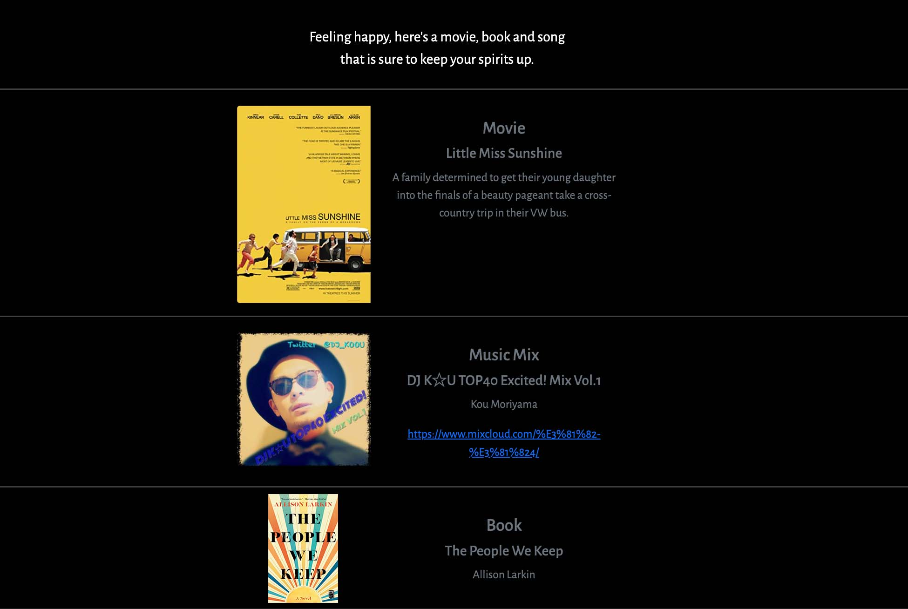
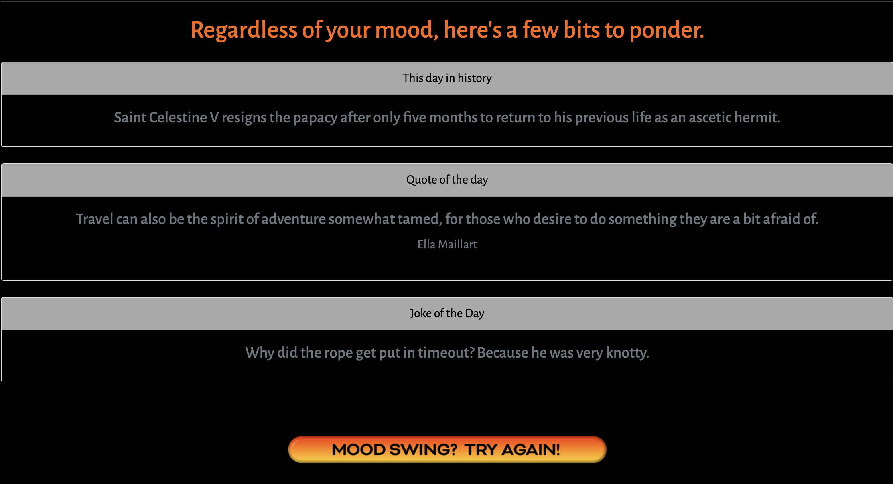

# face-the-day
## Description

This app helps you face your day by populating movies, songs, and books based on your mood. As a bonus, it'll provide you with a funny joke, a notable quote, and what happened this day in history — to help you face your day.

## Table of Contents

- [Installation](#installation)
- [Usage](#usage)
- [Credits](#credits)
- [License](#license)

## Installation

Go to [app page](https://bka-2cycle.github.io/face-the-day) and follow the prompts.

## Usage

Start by choosing a "Happy" or "Sad" mood, then click on "Get Me On My Way!" button to go through the prompts as shown below:

If you don't choose a mood a prompt will remind you to select "Happy" or "Sad" to continue

Based on your mood you'll get a movie, song and book suggestions

Regardless of your mood, you'll get what happened this day in history, a quote of the day, and a joke of the day. If you don't like your results try the "Mood Swing, Try Again" button to restart the app, and generate new results!

## Credits

- [Adam Stovall](https://github.com/AHStovall)
- [Brian Allison](https://github.com/bka-2cycle)
- [Sha Chambers](https://github.com/SuzyChambers)
- [Salma Loum](https://github.com/SalmaLoum)
- [UCLA Extension Bootcamp](https://www.uclaextension.edu/?gclid=Cj0KCQiAgribBhDkARIsAASA5btdbwAz8x25r3b1deoRNIGxfkPFL11rAQMuCgQ7HYiqBH8CLr9CgLoaAktlEALw_wcB&gclsrc=aw.ds)
- [Erik Sytnyk Movie List](https://github.com/erik-sytnyk/movies-list/blob/master/db.json)
- [Benoit VALLON list 100 best books](https://github.com/benoitvallon/100-best-books)

## License

Please refer to the LICENSE in the repo.
